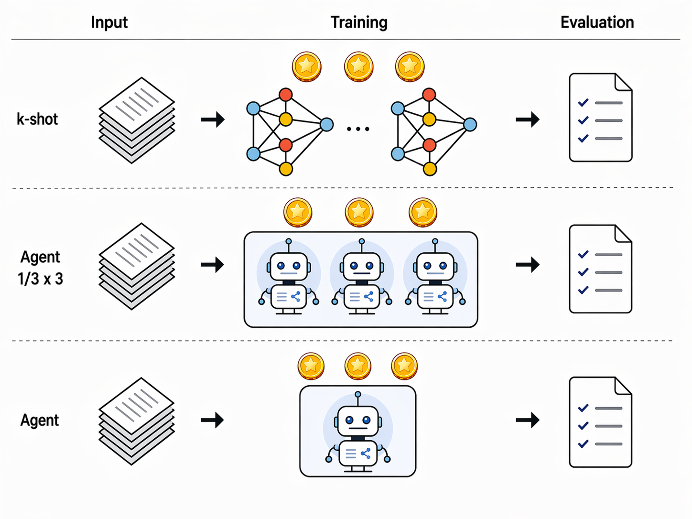

# When Independent Sampling Outperforms Agentic Reasoning

Tooling to evaluate LLM coding agents on Codeforces problems. The repo packages problem statements into [SWE-bench](https://www.swebench.com/)-style instances, runs **one-shot LLM baselines** that submit code straight to the Codeforces judge, and **launches SWE-agent** for agentic baselines using a bundled fork.



## Repository Structure

```
.
├── data_sample/                           # 5-problem-per-file sample dataset
├── data/                                  # (you create this) full dataset
├── SWE-agent/                             # bundled SWE-agent fork (install from source)
├── docker/                                # Dockerfile + build script for swea-cf-tiny image
├── scripts/                               # bash wrappers
├── exps/                                  # multi-run launchers and probability-estimation experiments
├── problem_statements_data.py             # build div{1,2,3}.json from CF API
├── select_problems.py / parse_cf.py       # CF API helpers (problem statements, standings, submissions)
├── convert_to_swebench_dataset.{py,ipynb} # legacy: build cf_swebench_style.json from cf_submissions/
├── oneshot_baseline.py                    # one-shot LLM baseline (LiteLLM → CF judge)
├── example_config.yaml                    # Jinja templates used by oneshot_baseline.py
├── report.py / analyze_*.py               # plots, tables, trajectory analysis
└── requirements.txt
```

## Setup

### 1. Python environment

```bash
conda create -n codeforces python=3.11
conda activate codeforces
pip install -r requirements.txt
```

### 2. Build the Docker sandbox

SWE-agent runs each problem inside the `swea-cf-tiny` image (Python 3.11 + g++/cmake + swe-rex preinstalled for fast startup):

```bash
cd docker && ./build.sh && cd ..
```

### 3. Install SWE-agent from the bundled fork

```bash
cd SWE-agent
pip install -e .
cd ..
```

See [SWE-agent installation docs](https://swe-agent.com/latest/installation/source/) for details.

### 4. API keys (`.env`)

Create a `.env` at the repo root:

```bash
CF_API_KEY=<your-codeforces-api-key>          # required for one-shot baseline (submission API)
ANTHROPIC_API_KEY=<...>                        # any LiteLLM-supported provider keys
OPENAI_API_KEY=<...>
GEMINI_API_KEY=<...>
```

The Codeforces submission API is gated; see https://codeforces.com/api/help. LM provider keys follow LiteLLM's convention — see https://swe-agent.com/latest/installation/keys/.

## Data

Two SWE-bench-style formats are used. Each entry has `instance_id`, `problem_statement`, `image_name` (`swea-cf-tiny`), `repo_name` (`./SWE-agent` — used as the per-problem workspace), and `extra_fields` (contestId, index, name, examples).

| File | Built by | Instance-id format | Purpose |
| --- | --- | --- | --- |
| `data/div{1,2,3}.json` | `problem_statements_data.py` | `2061A` | Per-division splits (Codeforces Div. 1 / 2 / 3); used by SWE-agent and the one-shot launchers. |
| `data/cf_swebench_style.json` | `convert_to_swebench_dataset.py` (legacy) | `2061b_kevin` | Older flat dataset built from `cf_submissions/`. Kept for reproducibility. |

A 5-problem-per-file sample lives at [`data_sample/`](data_sample/) for quick smoke tests:

```bash
ln -s data_sample data    # or pass --dataset data_sample/... explicitly
```

### Generating fresh SWE-bench-style data

Edit the contest-id lists at the top of [`problem_statements_data.py:54`](problem_statements_data.py#L54) and run:

```bash
python problem_statements_data.py
```

This calls the Codeforces problem-statements API (requires `CF_API_KEY`), cleans each problem, base64-decodes the example tests, and writes/updates `data/div{1,2,3}.json` (deduplicated by `instance_id`).

## Running One-Shot Baselines

[`oneshot_baseline.py`](oneshot_baseline.py) prompts an LLM with each problem statement, extracts code from the response, and submits to the Codeforces judge via `CF_API_KEY`. Results are written one JSON file per attempt under `--output`.

### Direct invocation

```bash
python oneshot_baseline.py \
    --config example_config.yaml \
    --dataset data/div1.json \
    --model claude-sonnet-4-20250514 \
    --output oneshot_baselines/claude-sonnet-4-20250514_t-0.50/div1 \
    --temperature 0.5 \
    --k 1
```

Available flags:

| Flag | Purpose |
| --- | --- |
| `--config` | YAML with `system_template` and `instance_template` (Jinja). See [`example_config.yaml`](example_config.yaml). |
| `--dataset` | SWE-bench-style JSON file. |
| `--model` | LiteLLM model name (e.g. `claude-sonnet-4-20250514`, `o3`, `gemini/gemini-2.5-pro`). |
| `--output` | Output directory (per-problem subdirs, plus `logs/`). |
| `--k` | Attempts per problem (default 1). |
| `--temperature` | LLM sampling temperature (default 0.0). |
| `--slice` | Python-style slice over the dataset, e.g. `:10`, `10:20`. |
| `--shuffle` / `--shuffle_seed` | Deterministic shuffle before slicing. |
| `--instance_filter` | Restrict to specific `instance_id`s. |
| `--level_filter` | Restrict to specific problem indices (e.g. `A B C`). |
| `--contest_id_filter` | Restrict to specific contest IDs. |

### Wrapper script

```bash
n_data=10 model=claude-sonnet-4-20250514 ./scripts/run_oneshot_baseline.sh
n_data=10 model=o3 temperature=1.0       ./scripts/run_oneshot_baseline.sh
```

### Multi-run launcher

[`exps/launch_oneshot.py`](exps/launch_oneshot.py) runs `oneshot_baseline.py` 5× over the most recent contests in the chosen division. Edit `model`, `div`, and the `up_to_date` cutoff at the top of `main()` and run:

```bash
python exps/launch_oneshot.py
```

## Running SWE-Agent

The bundled fork ships with four CP-tuned config files at [`SWE-agent/config/`](SWE-agent/config/): `cp_claude.yaml`, `cp_o3.yaml`.

### Single batch run

```bash
sweagent run-batch \
    --num_workers=1 \
    --instances.type=file \
    --instances.path=data/div1.json \
    --instances.deployment.python_standalone_dir="" \
    --config=config/cp_claude.yaml \
    --agent.model.name=claude-sonnet-4-20250514 \
    --agent.model.temperature=0.5 \
    --agent.model.per_instance_cost_limit=2.00
```

Useful additions:
- `--instances.slice=:2` — try just the first two problems.
- `--instances.filter=2061A` — restrict to a single instance (regex).
- `--agent.model.name=human` — drive the agent yourself (for tool development).

Output trajectories land under `SWE-agent/trajectories/<user>/<config>__<model>__t-<temp>__p-<top_p>__c-<cost>___div<div>/`.

### Multi-run launchers

- [`exps/launch_agent_probability_estimation.py`](exps/launch_agent_probability_estimation.py) — repeatedly invokes `sweagent run-batch` for a single instance until the 95% Clopper–Pearson CI on success probability is short enough. Edit `instance_id`, `div`, `cost_limit`, and `model` in `main()`.
- [`exps/launch_probability_estimation.py`](exps/launch_probability_estimation.py) — same idea but for the one-shot baseline.

```bash
python exps/launch_agent_probability_estimation.py
python exps/launch_probability_estimation.py
```

Both honor the optional `SWE_AGENT_USER` env var (defaults to `getpass.getuser()`) when locating trajectory directories.
